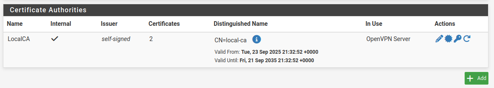
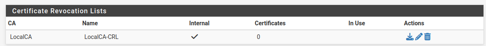
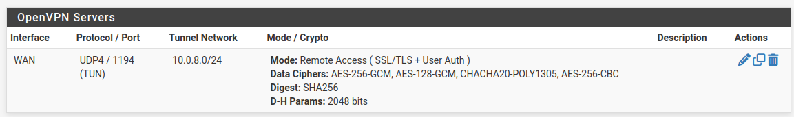
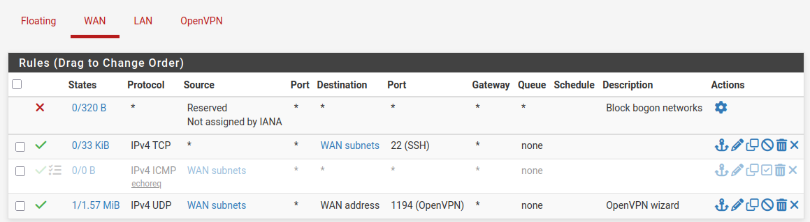
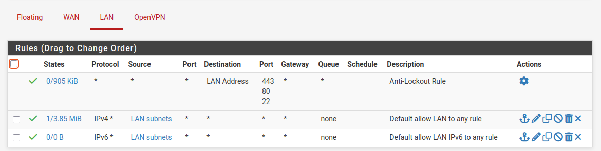
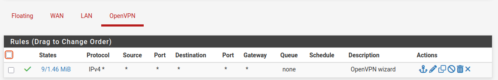
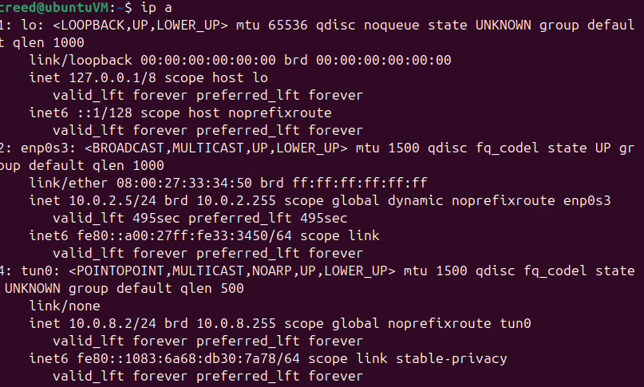

# pfSense OpenVPN Project

A personal project to configure **pfSense** with **OpenVPN** in **Oracle VirtualBox**, enabling a WAN client to securely access services on a LAN via certificate‑based authentication and least‑privilege firewall rules.

> This repo documents the full build, the decisions behind it, and the troubleshooting journey (including a VirtualBox NAT Network issue resolved by upgrading VirtualBox).

---

## Table of Contents
- [Overview](#overview)
- [Architecture](#architecture)
- [Environment](#environment)
- [Network Plan](#network-plan)
- [Configuration Summary](#configuration-summary)
- [Client Setup & Verification](#client-setup--verification)
- [Troubleshooting Highlights](#troubleshooting-highlights)
- [Security Notes](#security-notes)
- [Commands Used](#commands-used)
- [Artifacts & Screenshots](#artifacts--screenshots)
- [Results](#results)
- [Lessons Learned](#lessons-learned)

---

## Overview
This project demonstrates a practical VPN deployment using **pfSense** as the firewall/VPN server and **OpenVPN** for secure client connectivity. The build simulates a typical enterprise scenario: a client on the **WAN** side connects to the **LAN** through an encrypted tunnel and reaches internal resources.

Key capabilities demonstrated:
- Building a **Certificate Authority (CA)** and **CRL** in pfSense
- Issuing a **server certificate** for OpenVPN and a **user certificate** for the client
- Deploying **OpenVPN (UDP/IPv4)** with a dedicated tunnel network
- Enforcing access via **pfSense firewall rules**
- Exporting and using a client profile to establish the tunnel from a WAN host
- Verifying **end‑to‑end connectivity** and documenting the **troubleshooting process**

---

## Architecture
```
              (Host Internet)
                    ↑
         VirtualBox NAT Network (e.g., 192.168.200.0/24)
                 ┌──────────────┬──────────────┐
                 │              │              │
           pfSense (WAN)   Ubuntu WAN VM  (other WAN VMs)
             192.168.200.4     192.168.200.5
                   │
                   │  pfSense
                   │
           Internal Network (LAN, 192.168.1.0/24)
                   │
              Ubuntu LAN VM  (e.g., 192.168.1.101)

           OpenVPN tunnel (10.0.8.0/24)
             WAN client ⇄ pfSense ⇄ LAN services
```

---

## Environment
- **Virtualization**: Oracle VirtualBox (upgraded to resolve NAT Network bug)
- **Firewall/VPN**: pfSense
- **Clients**: Ubuntu (LAN), Ubuntu (WAN)
- **OpenVPN**: UDP over IPv4, local user auth + client certs

> Note: The project initially used a VirtualBox **NAT Network** named `NATNETWORK`. Connectivity issues on that network were resolved by **upgrading VirtualBox** to the latest version.

---

## Network Plan
| Segment        | Example CIDR        | Notes                                   |
|----------------|----------------------|-----------------------------------------|
| WAN (NAT Net)  | `192.168.200.0/24`   | VirtualBox NAT Network; DHCP enabled    |
| LAN (Internal) | `192.168.1.0/24`     | pfSense‑backed internal network         |
| VPN Tunnel     | `10.0.8.0/24`        | OpenVPN tunnel network                  |

Representative addresses (from one run):
- pfSense **WAN**: `192.168.200.4` (gateway `192.168.200.1`)
- Ubuntu **WAN** client: `192.168.200.5`
- pfSense **LAN**: `192.168.1.1`
- Ubuntu **LAN** host: `192.168.1.101`
- OpenVPN **client**: `10.0.8.2`

---

## Configuration Summary
**pfSense**:
- **CA & CRL**: Created a CA `Local CA` and a CRL for lifecycle management.
- **Certificates**: Issued a **Server Certificate** (`openvpn.local`) for the VPN.
- **OpenVPN (Wizard)**:
  - Type: **Local User Access**
  - Protocol: **UDP/IPv4**, Interface: **WAN**
  - Tunnel Network: `10.0.8.0/24`
  - Local Network: `192.168.1.0/24`
  - Defaults retained where sensible
- **Firewall**:
  - **WAN rule** allowing OpenVPN from the WAN client network
  - **LAN rule(s)** permitting LAN↔VPN as needed for testing
- **Routing/DNS**:
  - Confirmed default route to VirtualBox NAT GW (e.g., `192.168.200.1`)
  - Set explicit DNS (e.g., `8.8.8.8`, `1.1.1.1`) and disabled WAN DHCP override when testing

**User & Client Export**:
- Added a local user with a certificate signed by `Local CA`
- Installed **openvpn‑client‑export** package
- Exported a `*.ovpn` profile for the user

---

## Client Setup & Verification
On the **Ubuntu WAN VM** (attached only to the VirtualBox NAT Network):

1. **Transfer profile securely**
   - Enabled SSH temporarily on pfSense
   - Copied the exported profile off the firewall:
     ```bash
     # From a trusted machine or the WAN VM
     scp user@pfsense:/path/to/exported-profile.ovpn ./
     ```
   - Removed the exported file from pfSense after transfer (contains keys/certs)

2. **Start OpenVPN**
   ```bash
   sudo openvpn --config ./exported-profile.ovpn
   ```

3. **Validate interfaces & routes**
   ```bash
   ip a                  # shows tunnel (e.g., 10.0.8.2)
   ping 192.168.1.1      # pfSense LAN interface
   ping 192.168.1.101    # Ubuntu LAN host
   ```

Successful pings confirmed **end‑to‑end** connectivity through the tunnel from WAN → VPN → LAN.

---

## Troubleshooting Highlights
**Symptom:** pfSense (and the WAN VM) could not ping the NAT gateway (`192.168.200.1`) or external IPs, despite receiving a DHCP lease on the NAT Network.

**What I checked:**
- pfSense routes (default route present to `192.168.200.1`)
- Outbound NAT (automatic)
- LAN/WAN firewall rules
- DNS override vs static DNS
- Recreated the VirtualBox NAT Network with DHCP enabled

**Resolution:**
- The issue traced back to **VirtualBox NAT Network behavior** in the installed version.
- After **upgrading VirtualBox**, WAN connectivity began working immediately (pfSense and WAN VM could ping the gateway and reach `8.8.8.8`).

**Takeaway:** Always validate each layer: **hypervisor network → pfSense interface/gateway → firewall/NAT → DNS**.

---

## Security Notes
- Exported **client profiles** include sensitive **private keys** and **certs**; they were **removed from pfSense** after transfer.
- SSH was enabled **temporarily** on pfSense for file transfer and then returned to the default posture.
- Firewall rules follow a **least‑privilege** approach: only required ports from the specific **WAN client network** to pfSense, and scoped LAN access for verification.

---

## Commands Used
```bash
# On WAN client: run OpenVPN with exported profile
sudo openvpn --config ./exported-profile.ovpn

# Secure copy of client profile (example)
scp user@pfsense:/var/etc/openvpn/client-exports/exported-profile.ovpn ./

# Basic connectivity checks
ip a
ip route
ping 8.8.8.8
ping 192.168.1.1
ping 192.168.1.101
```

---

## Artifacts & Screenshots
Place screenshots under `docs/screenshots/` and reference them below:

- **CA and CRL**: `ca.png`
- **OpenVPN Server**: `docs/screenshots/openvpn-server.png`
- **Firewall Rules**: `docs/screenshots/firewall-rules.png`
- **WAN VM `ip a` (connected)**: `docs/screenshots/wan-ip-a.png`
- **Ping WAN→LAN (success)**: `docs/screenshots/ping-wan-to-lan.png`









Example Markdown includes:
```markdown


```

---

## Results
- OpenVPN server on pfSense reachable from WAN
- Client receives tunnel address (e.g., `10.0.8.2`)
- Client can reach pfSense LAN and a host on `192.168.1.0/24`
- Troubleshooting documented; root cause tied to VirtualBox version

---

## Lessons Learned
- Small hypervisor mismatches (e.g., NAT Network behavior) can mimic firewall/routing issues—**confirm the substrate first**.
- Keep **sensitive materials** off security devices after use (client exports, temporary files).
- Explicit DNS settings help distinguish **routing** problems from **name resolution** problems during testing.

---

> **Repository Metadata**
>
> **Name**: `pfSense-OpenVPN-Project`
>
> **Description**: *Personal project configuring pfSense with OpenVPN, certificates, and firewall rules to enable secure client-to-LAN connectivity.*
